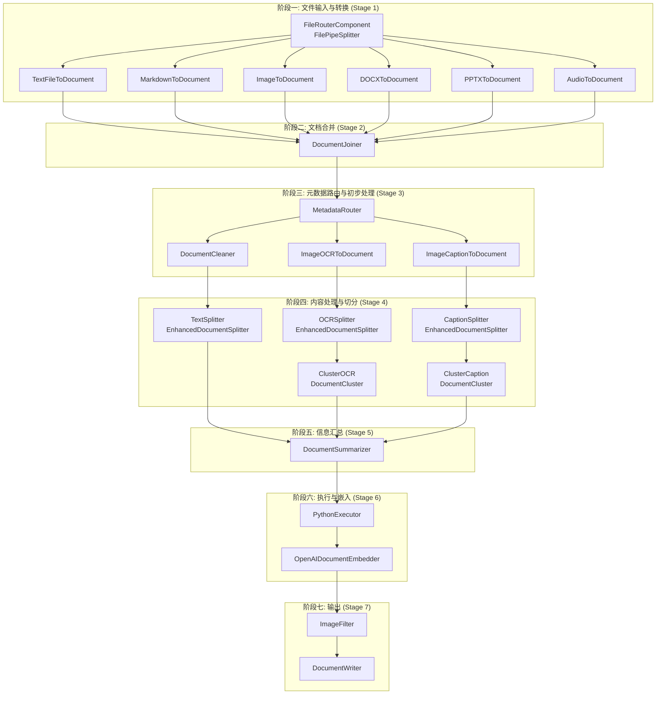

# rag-demo
一个使用 Chainlit+Haystack 的 RAG（检索增强生成）学习项目

## 项目概述
本项目演示了如何使用现代工具构建检索增强生成(RAG)系统，通过结合文档检索和大语言模型能力，提供基于知识库的精准回答。

## 技术栈
- **Chainlit**：提供直观的对话式前端界面
- **Haystack**：提供完整的RAG系统组件支持
- **向量数据库**：支持FAISS或Chroma存储文档向量
- **大语言模型**：可配置使用不同的LLM提供生成能力

## 文件结构
```
rag_demo/
├── data/                      # 存放原始数据和索引数据
│   ├── raw_documents/         # 存放原始文档 (PDF, TXT, MD 等)
│   │   ├── doc1.pdf
│   │   └── another_topic.txt
│   └── faiss_document_store.db # (示例) Haystack FAISS 索引文件
│   └── document_store.faiss   # (示例) FAISS 索引的另一个常见命名
├── pipelines/                 # 存放 Haystack Pipeline 的定义
│   ├── components/         # 存放原始文档 (PDF, TXT, MD 等)
│   │   ├── doc1.pdf
│   │   └── another_topic.txt
│   ├── __init__.py
│   ├── index.py               # 定义数据索引的 Haystack Pipeline
│   ├── query.py               # 定义查询和生成的 Haystack Pipeline
│   ├── llm.py                 # 定义与 LLM 交互的 Client
│   └── utils.py               # Pipeline 相关的辅助函数 (可选)
├── app.py                     # Chainlit 应用的主文件（用户与 RAG 系统的前端交互）
├── config/                    # 配置文件
│   ├── __init__.py
│   ├── settings.py            # 应用配置 (API Keys, 路径, 模型名称等)
│   └── logging_config.yaml    # (可选) 日志配置
├── scripts/                   # (可选) 辅助脚本
│   ├── run_indexing.py        # 运行索引流程的脚本
│   └── bulk_upload_data.sh    # (示例) 批量上传数据的脚本
├── .env                       # 存储环境变量 (API 密钥等，不应提交到 Git)
├── requirements.txt           # Python 依赖包列表
├── README.md                  # 项目说明文件
└── .gitignore                 # 指定 Git 应忽略的文件和目录
```

## 系统流程
1. **数据处理**：将原始文档放在`data/raw_documents/`目录下
2. **索引构建**：使用`pipelines/index.py`中定义的流程将文档转换为向量并存入向量数据库
3. **查询处理**：当用户提问时，系统使用`pipelines/query.py`中的流程检索相关文档并生成回答
4. **前端交互**：通过Chainlit提供的界面，用户可以自然地与RAG系统进行对话




## 快速开始
1. 安装依赖：
   ```bash
   pip install -r requirements.txt
   ```

2. 配置环境变量：
   创建`.env`文件并添加必要的API密钥

3. 构建索引：
   ```bash
   python scripts/run_indexing.py
   ```

4. 启动应用：
   ```bash
   chainlit run app.py
   ```

## 代码仓库
GitHub: https://github.com/chasey-ai/rag-demo

## 贡献指南
欢迎提交PR或Issue来改进此项目。具体贡献流程请参考贡献指南文档。

## 许可证
MIT